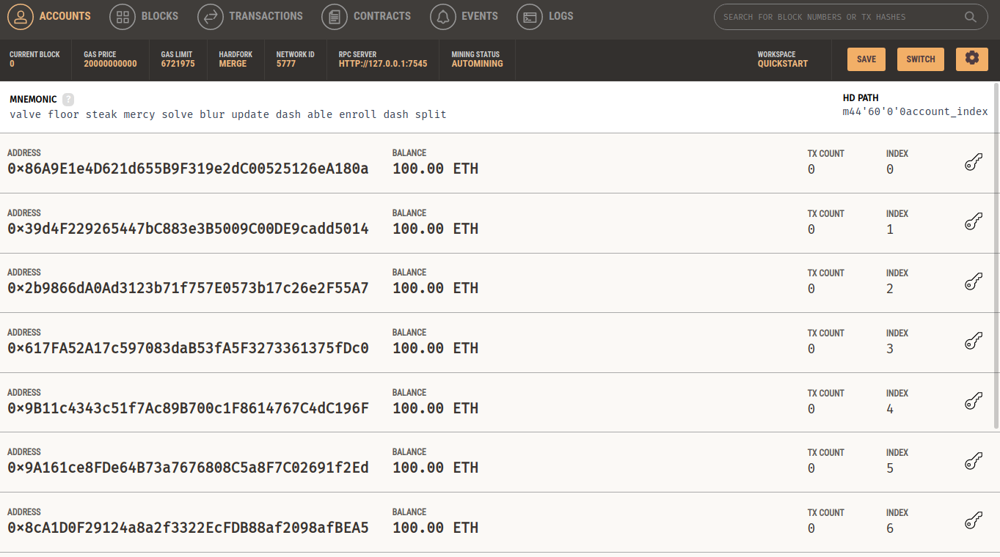

# **Smart Contract**

## **# Create A Truffle Project**

```
mkidr 2
cd 2
truffle init
tree
```


---

## **# Create A file that will contain a Smart Contract**

Create a file with .sol as extension filename.sol and open it.

```
cd contracts
touch HelloWorld.sol
```


_Note: Usually PascalCasing is used for naming solidity files._

---

## **# Open truffle project in your desired code editor and open HelloWorld.sol**


---

## **# Specify what version of Solidity compiler to use.**

**Syntax:** pragma solidity **version**; <br><br>
**Example:**

```
pragma solidity >=0.8.17;
```

---

## **# Create a Contract**

```
pragma solidity >=0.8.17;
// SPDX-License-Identifier: UNLICENSED

contract HelloWorld {
    uint256 number;

    function store(uint256 num) public {
        number = num;
    }

    function get() public view returns (uint256) {
        return number;
    }
}

```


### **pragma solidity >=0.8.17;**

- The first line of the contract, , specifies the version of the Solidity compiler that this contract should be compiled with

### **uint256 number;**

- The contract contains a state variable number of type uint256.
- This variable will hold the value that is set by the store() function and retrieved by the get() function.

### **store(uint256 num)**

- The store() function is a public function that takes a num parameter of type uint256.
- This function sets the value of number to the value of num.

### **get()**

- The get() function is also a public function that returns the value of number.
- Since it is a view function, it does not modify the state of the contract and can be called without incurring any gas costs.

---

## **# Deployment**

### **Start Ganache**

- Launch terminal and type

  ```
  ganache
  ```

  

- Click on Quickstart
  
  

- Click on settings button
  

  Click on server and notedown **HOSTNAME**, **PORT** And **NETWORK ID**
  

### **Configure Truffle Project**

- Inside truffle project open **truffle-config.js file** and paste following code

  ```
  module.exports = {
  networks: {
      development: {
      host: "127.0.0.1",
      port: 7545,
      network_id: "*",
      },
  },
  mocha: {},
  compilers: {
      solc: {
      version: "0.8.19",
      },
  },
  };

  ```

  

  _Replace host and port with ganache server hostname and port noted down in previous step_

### **Deploy**

- Inside **/migrations** directory create a file named **2_deploy_contract.js**. this will contain code for deployment

  ```
  const HelloWorld = artifacts.require("HelloWorld");

  module.exports = function (deployer) {
  deployer.deploy(HelloWorld);
  };
  ```

  

- In terminal. Run `truffle migrate --network development`
  

## **# Confirm Deployment**

- Launch Ganache and click on transactions
  

- A New Transaction is apeared for contract creation that means our contract is deployed successfully
  

## **# Interact with Deployed contract using Truffle Console**

- In Terminal type: `truffle console`
  

- Run following code to load the contract

  ```
  const HelloWorld = artifacts.require("HelloWorld");
  const contract = await HelloWorld.deployed();
  ```

  

- Call the store() function of the contract

  ```
  await contract.store(42);
  ```

  

- Call the get() function of the contract
  ```
  const result = await contract.get();
  console.log(result.toNumber());
  ```
  
