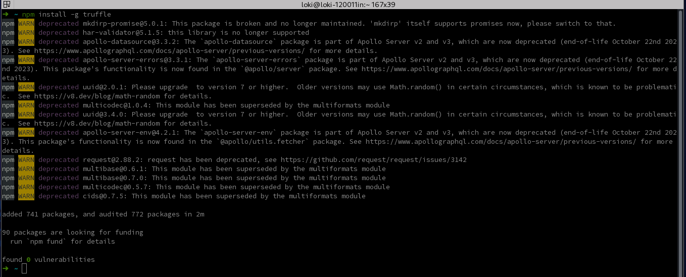
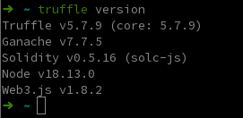
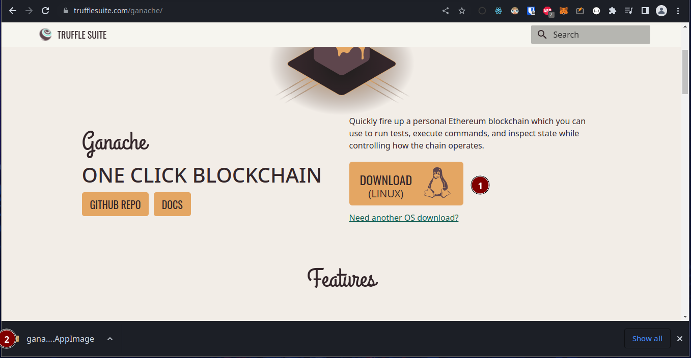
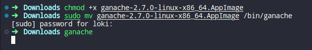
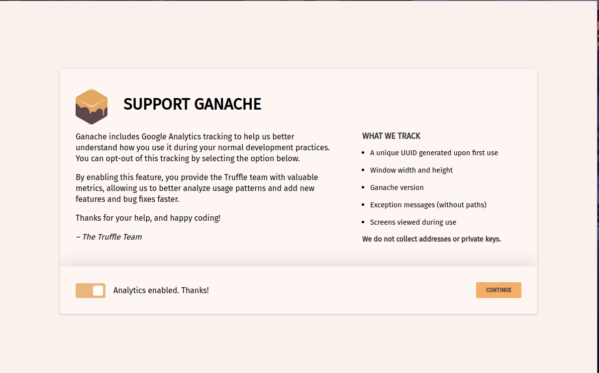
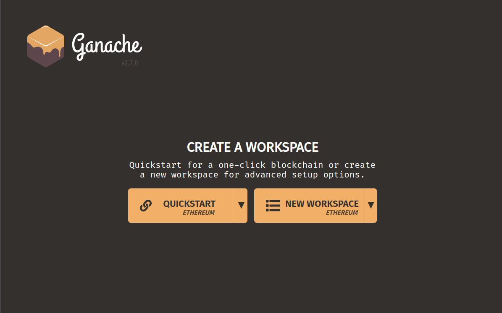
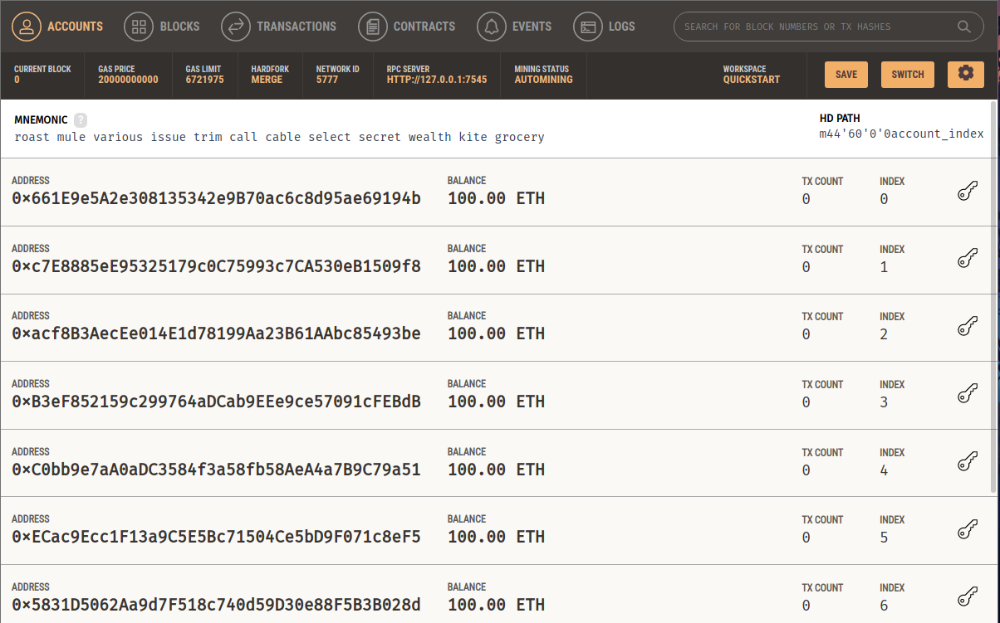
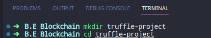
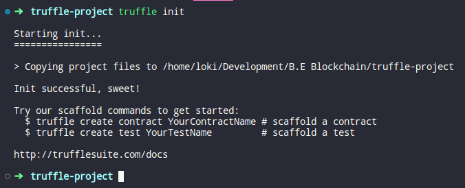
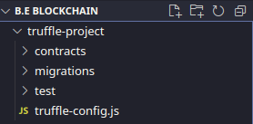

# Theory: Introduction To Truffle

<details>
<summary>Introduction</summary>
Truffle is a popular development framework for Ethereum blockchain-based decentralized applications (dApps). It provides a suite of tools that simplifies the development process of smart contracts and dApps on Ethereum, allowing developers to focus on the core logic of their applications.

Truffle includes a development environment, a testing framework, and a deployment pipeline, making it a comprehensive solution for building and deploying decentralized applications. Some of the key features of Truffle include:

1.  Smart contract compilation and linking
2.  ontract migration management
3.  Automated contract testing
4.  Built-in support for popular development frameworks like React and Angular
5.  Integration with various Ethereum clients like Ganache and Infura
6.  Network management for deploying contracts to various Ethereum 7. networks

Overall, Truffle is a powerful tool for developers looking to build decentralized applications on Ethereum. It helps simplify the development process by providing a comprehensive suite of tools that streamline contract development, testing, and deployment.

</details>
<br>

# To establish a local blockchain using Truffle

Truffle requires Ganache, a personal blockchain for Ethereum development, to be installed.

## Install Truffle

### Requirments

- Node.js v14 - v18
- Windows, Linux, or macOS

### Install

- In a terminal, use NPM to install Truffle:

  ```
  npm install -g truffle
  ```

  

- You may receive a list of warnings during installation. To confirm that Truffle was installed correctly, run:

  ```
  truffle version
  ```

  

## Install Ganache

---

- Download and install ganache from https://trufflesuite.com/ganache/
  

### Install on linux

---

Once Ganache appimage is download do following

```
chmod +x ganache-2.7.0-linux-x86_64.AppImage
sudo mv ganache-2.7.0-linux-x86_64.AppImage /bin/ganache
```



### Setup Ganache

---

Click on continue


Click on Quickstart


Accounts Dashboard


## Create a new Truffle project

---

- Open a terminal and create a new directory for your Truffle project and navigate to that directory

  

- Run Following command

  ```
  truffle init
  ```

  

  This will create a new Truffle project with the basic project structure.

  
